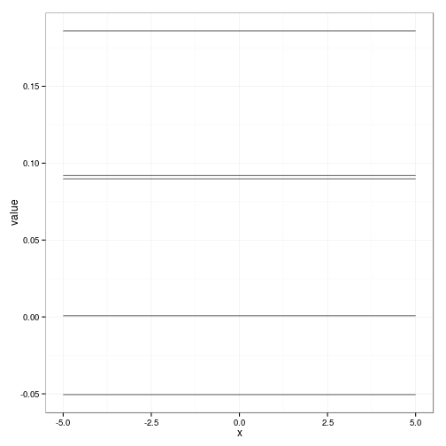

# Title


```r
require(knitr)
require(MASS)
require(data.table)
require(ggplot2)
```


## Definitions

_Gaussian process_ is a stochastic process where any finite number of
random variables have a joint Gaussian distribution.

A Gaussian process is completely specified by its _mean function_
\(m(x)\) and _covariance function_ \(k(x,x')\). They are defined by

\[m(x) = \mathcal{E}[f(x)],\]

\[ k(x,x') = \mathcal{E}[(f(x) − m(x))(f(x') − m(x'))],\]

and will write the Gaussian process as \( f(x) \sim GP(m(x), k(x,
x'))\).


## Squared exponential


\[ cov(f(x_p), f (x_q)) = k(x_p , x_q) =
    \exp\Big(−\frac{1}{2} |x_p − x_q |\Big)^2.\]


```r
x <- seq(-5,5,0.5)

sim.number <- 5


squared.exp <- function(x,y,l=1) {
  exp(-0.5* (norm(x-y, type="2")/l)^2)
}

Sigma <- function(x1, x2, l=1) {
  n1 <- length(x1)
  n2 <- length(x2)
  S <- matrix(rep(0, n1*n2), nrow=n1)
  for (i in 1:n1) {
    for (j in 1:n2) {
      S[i,j] <- squared.exp(x1[i],x2[j],l)
    }
  }
  S
}

S <- Sigma(x,x)
sims <- data.table(x=x)
gens <- mvrnorm(sim.number, rep(0, length(x)), S)
sims <- cbind(sims, t(gens))
ggplot(sims,aes(x)) + geom_line(aes(y=V1)) +
    geom_line(aes(y=V2)) +
        geom_line(aes(y=V3)) 
```

 

## Formula que jode a Maria

\[\overline{y}^* = K^*(\lambda^2\cdot I+K)^{-1}\cdot y \]

\[C = K^{**}-K^*\cdot(\lambda^2\cdotI+K)^{-1}\cdot(K^*)^t \]


```r
x <- c(-4,-3,-1,0,2)
y <- c(-2,0, 1, 2, -1)

input <- data.table(x=x, y=y)

x.star <- seq(-5,5,0.1)
K <- Sigma(x,x)
K.star2 <- Sigma(x.star, x.star)
K.star <- Sigma(x.star, x)


y.star.bar <- K.star %*% solve(K) %*% y
C <- K.star2 - K.star %*% solve(K) %*% t(K.star)
y.star.bar
```

```
##                 [,1]
##   [1,] -1.683863e+00
##   [2,] -1.819761e+00
##   [3,] -1.942833e+00
##   [4,] -2.048476e+00
##   [5,] -2.132239e+00
##   [6,] -2.190044e+00
##   [7,] -2.218410e+00
##   [8,] -2.214672e+00
##   [9,] -2.177166e+00
##  [10,] -2.105371e+00
##  [11,] -2.000000e+00
##  [12,] -1.863030e+00
##  [13,] -1.697656e+00
##  [14,] -1.508182e+00
##  [15,] -1.299849e+00
##  [16,] -1.078598e+00
##  [17,] -8.508064e-01
##  [18,] -6.229803e-01
##  [19,] -4.014531e-01
##  [20,] -1.920863e-01
##  [21,] -1.848611e-16
##  [22,]  1.706547e-01
##  [23,]  3.168683e-01
##  [24,]  4.368831e-01
##  [25,]  5.302369e-01
##  [26,]  5.977407e-01
##  [27,]  6.413925e-01
##  [28,]  6.642377e-01
##  [29,]  6.701822e-01
##  [30,]  6.637711e-01
##  [31,]  6.499450e-01
##  [32,]  6.337856e-01
##  [33,]  6.202612e-01
##  [34,]  6.139855e-01
##  [35,]  6.189966e-01
##  [36,]  6.385661e-01
##  [37,]  6.750459e-01
##  [38,]  7.297564e-01
##  [39,]  8.029224e-01
##  [40,]  8.936577e-01
##  [41,]  1.000000e+00
##  [42,]  1.118994e+00
##  [43,]  1.246821e+00
##  [44,]  1.378966e+00
##  [45,]  1.510421e+00
##  [46,]  1.635911e+00
##  [47,]  1.750126e+00
##  [48,]  1.847968e+00
##  [49,]  1.924772e+00
##  [50,]  1.976517e+00
##  [51,]  2.000000e+00
##  [52,]  1.992967e+00
##  [53,]  1.954204e+00
##  [54,]  1.883579e+00
##  [55,]  1.782027e+00
##  [56,]  1.651500e+00
##  [57,]  1.494864e+00
##  [58,]  1.315773e+00
##  [59,]  1.118507e+00
##  [60,]  9.077980e-01
##  [61,]  6.886466e-01
##  [62,]  4.661392e-01
##  [63,]  2.452718e-01
##  [64,]  3.078935e-02
##  [65,] -1.729560e-01
##  [66,] -3.621228e-01
##  [67,] -5.334734e-01
##  [68,] -6.844392e-01
##  [69,] -8.131592e-01
##  [70,] -9.184916e-01
##  [71,] -1.000000e+00
##  [72,] -1.057917e+00
##  [73,] -1.093089e+00
##  [74,] -1.106896e+00
##  [75,] -1.101174e+00
##  [76,] -1.078107e+00
##  [77,] -1.040134e+00
##  [78,] -9.898387e-01
##  [79,] -9.298570e-01
##  [80,] -8.627793e-01
##  [81,] -7.910718e-01
##  [82,] -7.170075e-01
##  [83,] -6.426138e-01
##  [84,] -5.696348e-01
##  [85,] -4.995108e-01
##  [86,] -4.333724e-01
##  [87,] -3.720481e-01
##  [88,] -3.160835e-01
##  [89,] -2.657692e-01
##  [90,] -2.211752e-01
##  [91,] -1.821883e-01
##  [92,] -1.485511e-01
##  [93,] -1.198998e-01
##  [94,] -9.579895e-02
##  [95,] -7.577277e-02
##  [96,] -5.933135e-02
##  [97,] -4.599186e-02
##  [98,] -3.529466e-02
##  [99,] -2.681471e-02
## [100,] -2.016866e-02
## [101,] -1.501841e-02
```

```r
d <- c()
for (i in 1:dim(C)[1]) { d <- c(d,C[i,i]) }

ggplot() + geom_point(aes(x,y), size=3, colour="red") +
    geom_line(aes(x.star, y.star.bar)) +
        geom_ribbon(aes(x.star, ymax=y.star.bar+2*sqrt(abs(d)),
                        ymin=y.star.bar-2*sqrt(abs(d))), alpha=0.5) 
```

 

```r
heatmap(C)
```

 

```r
norm(Sigma(y.star.bar, y.star.bar) - C)/norm(C)
```

```
## [1] 3.152312
```

```r
y.sim=mvrnorm(1, y.star.bar, C)
sims <- data.table(x=x.star, y=y.sim)

ggplot(sims, aes(x)) + geom_line(aes(y=mvrnorm(1, y.star.bar, C)))+
    geom_line(aes(y=mvrnorm(1, y.star.bar, C))) +
        geom_point(data=input, aes(x,y), size=3, colour="red")
```

 

```r
d <- c()
for (i in 1:dim(C)[1]) { d <- c(d,C[i,i]) }
d
```

```
##   [1]  5.440927e-01  4.613650e-01  3.770400e-01  2.945326e-01  2.174467e-01
##   [6]  1.491953e-01  9.259164e-02  4.947069e-02  2.041135e-02  4.617916e-03
##  [11] -2.220446e-16  3.457134e-03  1.133652e-02  1.999680e-02  2.638493e-02
##  [16]  2.852445e-02  2.582381e-02  1.914328e-02  1.060162e-02  3.152017e-03
##  [21]  1.110223e-16  3.965958e-03  1.690561e-02  3.929117e-02  7.002708e-02
##  [26]  1.065324e-01  1.450763e-01  1.813105e-01  2.109116e-01  2.302293e-01
##  [31]  2.368373e-01  2.299010e-01  2.103035e-01  1.805117e-01  1.442017e-01
##  [36]  1.057025e-01  6.934559e-02  3.882360e-02  1.666306e-02  3.898009e-03
##  [41]  0.000000e+00  3.076339e-03  1.030186e-02  1.850705e-02  2.481612e-02
##  [46]  2.721836e-02  2.496761e-02  1.873659e-02  1.049822e-02  3.157109e-03
##  [51] -2.220446e-16  4.065828e-03  1.754817e-02  4.133394e-02  7.475499e-02
##  [56]  1.155901e-01  1.603122e-01  2.045360e-01  2.435948e-01  2.731577e-01
##  [61]  2.898007e-01  2.914578e-01  2.776973e-01  2.497964e-01  2.106146e-01
##  [66]  1.642889e-01  1.157945e-01  7.042694e-02  3.326861e-02  8.698742e-03
##  [71]  0.000000e+00  9.099353e-03  3.646352e-02  8.114972e-02  1.409939e-01
##  [76]  2.129033e-01  2.932110e-01  3.780460e-01  4.636761e-01  5.467900e-01
##  [81]  6.246958e-01  6.954282e-01  7.577692e-01  8.111950e-01  8.557712e-01
##  [86]  8.920173e-01  9.207629e-01  9.430123e-01  9.598285e-01  9.722448e-01
##  [91]  9.812040e-01  9.875238e-01  9.918829e-01  9.948237e-01  9.967645e-01
##  [96]  9.980177e-01  9.988095e-01  9.992993e-01  9.995957e-01  9.997713e-01
## [101]  9.998732e-01
```

## Large n

If $n$ is large, for example $n\geq 10000$, then to solve the equation
is not practical. Therefore is is usefull to develope approximate
solution.
